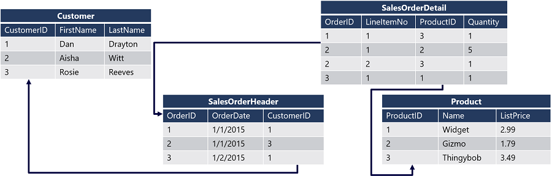
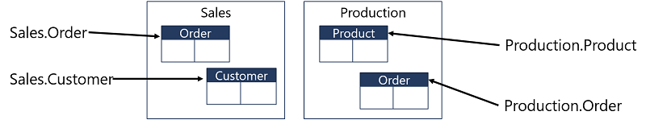

## Introduction
### The SQL language
- SQL is an acronym for Structured Query Language. 
- SQL is used to communicate with relational databases. 
- SQL is used to communicate with relational databases. 
- Some common RDBMS that use SQL include Microsoft SQL Server, MySQL, PostgreSQL, MariaDB, and Oracle.
- SQL language standard defined by the American National Standards Institute (ANSI).

Each vendor adds their own variations and extensions to SQL language.

### Transact SQL (T-SQL)
Basic SQL statements, such as `SELECT`, `INSERT`, `UPDATE`, and `DELETE` are available no matter what relational database system you're working with. 

Although these SQL statements are part of the ANSI SQL standard, many database management systems (DBMS) also have their own extensions.
These extensions provide functionality not covered by the SQL standard such as security management.

Microsoft database systems added some extensions on SQL language and called it **T-SQL** (SQL + Some Extensions).

### SQL is a declarative language
Programming Languages can be categorized as:
- _**Procedural Languages**_: enable you to define a sequence of instructions that the computer follows to perform a task.
- _**Declarative Languages**_: enable you to describe the output you want, and leave the details of the steps required to produce the output to the execution engine.

SQL supports some procedural syntax, but querying data with SQL usually follows declarative semantics.
- procedural syntax: you can write some statement such normal programming language (looping, condition), but this way doesn't the primary way to use SQL.
- declarative syntax: when you write SQL query, you only describe the results you want without details.

Database engine's **query processor** develops a **_query plan_** to retrieve the data.

### Relational data
SQL is most often (though not always) used to query data in _relational databases_.

A relational database is one in which the data has been organized in multiple tables (technically referred to as _relations_), each representing a particular type of:
- **entity**: customer, product, sales order
- **attributes**: name, price, sales order's order date
- **columns**: it's called an attribute 
- **row**: each row in the table represents an instance (object) of the entity type

The tables in the database are related to one another using **key columns** that uniquely identify the particular entity represented.
A **_primary key_** is defined for each table, and a reference to this key is defined as a **_foreign key_** in any related table.

The diagram shows a relational database that contains four tables:
* Customer
* SalesOrderHeader
* SalesOrderDetail
* Product

**_Composite primary_** key that combines two primary key at the same table **(SalesOrderDetail)**.
The combination of these values uniquely identifies a line item.

### Set-based processing
Set theory is fundamental to working with relational databases.
While you might be able to write queries in T-SQL without a thorough understanding of sets.
Without diving into the mathematics of set theory, you can think of a set as "a collection of definite, distinct objects considered as a whole."
For example, the Customer table represents a set: specifically, the set of all customers. You will see that the results of a `SELECT` statement also form a set.
One important feature to note about set theory is that there is no specification regarding any ordering of the members of a set.
Elements may be accessed (and retrieved) in any order.
If you need to return results in a certain order, you must specify it explicitly by using an `ORDER BY` clause in your `SELECT` query.

## Working with schemas

In SQL Server database systems, tables are defined within _schemas_ to create logical namespaces in the database.



Database systems such as SQL Server use a hierarchical naming system.
- helps to disambiguate tables with the same name in different schemas.
- The _fully qualified_ name of an object includes, database.schema.table **(Server1.StoreDB.Sales.Order)**

## Structure of SQL statements
SQL statements are grouped together into several different types of statements:
* **Data Manipulation Language** (DML) is the set of SQL statements that focuses on querying and modifying data such as `INSERT`, `UPDATE` and `DELETE`.
* **Data Definition Language** (DDL) is the set of SQL statements that handles the definition of the tables such as `CREATE`, `ALTER` and `DROP`.
* **Data Control Language** (DCL) is the set of SQL statements used to manage security permissions for users and objects such as `GRANT`, `REVOKE` and `DENY`.
* **Transaction Control Language** (TCL)
* **Data Modification Language** (DML)
* **Data Query Language** (DQL)

## Examine the `SELECT` statement
Consider the following query:
```sql
SELECT OrderDate, COUNT(OrderID) AS Orders
FROM Sales.SalesOrder
WHERE Status = 'Shipped'
GROUP BY OrderDate
HAVING COUNT(OrderID) > 1
ORDER BY OrderDate DESC;
```
here is the logical order at run time:

```sql
FROM Sales.SalesOrder
WHERE Status = 'Shipped'
GROUP BY OrderDate 
HAVING COUNT(OrderID) > 1
SELECT OrderDate, COUNT(OrderID) AS Orders
ORDER BY OrderDate DESC;
```

The run-time order of evaluation determines what data is available to which clauses, as a clause only has access to information already made available from an already processed clause.
For this reason, it's important to understand the true logical processing order when writing queries.

### Selecting all columns
The simplest form of a `SELECT` clause is the use of the asterisk character `*` to **return all columns**.
While SELECT * is suitable for a quick test, you should avoid using it in production work for the following reasons:
- Returning data that is not needed can slow down your queries and cause performance issues if the source table contains a large number of rows.
- Changes to the table that add or rearrange columns will be reflected in the query results, which may result in unexpected output for applications or reports that use the query.

```sql
SELECT * FROM Production.Product
```

SELECT clause can perform calculations and manipulations, which use operators to combine columns and values or multiple columns.
```sql
SELECT ProductID AS ID,
      Name + '(' + ProductNumber + ')' AS ProductName,
  ListPrice - StandardCost AS Markup
FROM Production.Product;
```

## Working with data type

Columns and variables used in Transact-SQL each have a data type.
The behavior of values in expressions depends on the data type.
we can use `+` operator to concatenate two `string` value or to add two `numeric` values. 

### Data type conversion
Compatible data type values can be implicitly converted as required.
For example, suppose you can use the + operator to add an _integer_ number to a _decimal_ number.
you may need to explicitly convert values from one data type to another - for example, trying to use + to concatenate a varchar value and a decimal value will result in an error, unless you first convert the numeric value to a compatible string data type.

### Explicitly convert between data type
1. `CAST` and `TRY_CAST`
CAST to convert the integer values in the ProductID column to varchar values (with a maximum of 4 characters) in order to concatenate them with another character-based value:

CAST is the ANSI standard SQL function for converting between data types, and is used in many database systems.

**_Syntax_**: `CAST(col_name AS data_type)`

```sql
SELECT CAST(ProductID AS varchar(4)) + ': ' + Name AS ProductName
FROM Production.Product;
```

The following query tries to convert values from this column to an integer data type:

```sql
SELECT CAST(size AS integer) AS NumericSize
FROM Production.Product;
```

>Error: Conversion failed when converting the nvarchar value 'M' to data type int.

Given that at least some of the values in the column are numeric, you might want to convert those values and ignore the others. 
You can use the `TRY_CAST` function to convert data types.

**_Syntax_**: `TRY_CAST(col_name AS data_type)`

```sql
SELECT TRY_CAST(Size AS integer) As NumericSize
FROM Production.Product;
```

The values that can be converted to a numeric data type are returned as _decimal_ values, and the incompatible values are returned as _NULL_, which is used to indicate that a value is unknown.

2. `CONVERT` and `TRY_CONVERT`

**_Syntax_**: `CONVERT(data_type, col_name)`

In Transact-SQL, you can also use the CONVERT function, as shown here:
```sql
SELECT CONVERT(varchar(4), ProductID) + ': ' + Name AS ProductName
FROM Production.Product;
```

Like CAST, CONVERT has a TRY_CONVERT variant that returns NULL for incompatible values.

Another benefit of using CONVERT over CAST is that CONVERT also includes a parameter that enables you specify a format style when converting numeric and date values to strings. For example, consider the following query:

```sql
SELECT SellStartDate,
       CONVERT(varchar(20), SellStartDate) AS StartDate,
       CONVERT(varchar(10), SellStartDate, 101) AS FormattedStartDate 
FROM SalesLT.Product;
```

3. `PARSE and TRY_PARSE`

The PARSE function is designed to convert formatted strings that represent numeric or date/time values.
For example, consider the following query (which uses literal values rather than values from columns in a table):

**_Syntax_**: `PARSE(string_type AS datat_type`

```sql
SELECT PARSE('01/01/2021' AS date) AS DateValue,
   PARSE('$199.99' AS money) AS MoneyValue;
```

| DateValue                   | MonyValue |
| --------------------------- | --------- |
| 2021-01-01T00:00:00.0000000 | 199.99    |

4. `STR`: The STR function converts a numeric value to a _varchar_.

**_Syntax_**: `STR(numeric_value)`
```sql
SELECT ProductID,  '$' + STR(ListPrice) AS Price
FROM Production.Product;
```

## Handle NULLs
A NULL value means _no value_ or _unknown_.
* It isn't equal to anything, and it’s not unequal to anything.
* It does not mean zero or blank, or even an empty string. 
* NULL isn't greater or less than anything.
* Those values are not unknown.

A NULL value can be used for values that haven’t been supplied yet.
As you've seen previously, a NULL value can also be returned by some conversion functions if a value is not compatible with the target data type `TRY_CAST` and `TRY_PARSE`.
We can’t say anything about what it is, but sometimes we need to work with NULL values.

T-SQL provides functions for conversion or replacement of NULL values.
1. `ISNULL`: takes two arguments. The first is an expression we are testing.

**_Syntax_**: `ISNULL(expression/col, replaced_val)` If the value of that first argument is NULL, the function returns the second argument.
If the first expression is not null, it is returned unchanged.

```sql
SELECT FirstName,
      ISNULL(MiddleName, 'None') AS MiddleIfAny,
      LastName
FROM Sales.Customer;
```

**_NOTE:_** The value substituted for NULL must be the same datatype as the expression being evaluated.

2. `COALESCE`: The `ISNULL` function is not ANSI standard, so you may wish to use the `COALESCE` function instead.
`COALESCE` is a little more flexible in that it **can take a variable number of arguments**, each of which is an expression.
**It will return the first expression in the list that is not** `NULL`.

**If there are only two arguments**, `COALESCE` behaves like `ISNULL`.
However, with **more than two arguments**, `COALESCE` can be used as an alternative to a multipart CASE expression using `ISNULL`.

If all arguments are NULL, COALESCE returns NULL.
All the expressions must return the same or compatible data types.

**_Syntax_**: `COALESCE(value1, value2, value3, ...)`

Replace `NULL` by 'Default Value'
```sql
SELECT COALESCE(NULL, 'Default Value');
```

If the phone column is NULL replace the NULL value by 'No Phone'
```sql
SELECT name, COALESCE(phone, 'No Phone') AS phone_number
FROM users;
```

The _email_ will be returned if it is not NULL.
If it is NULL, the _phone_ will be returned.
If both are NULL, 'No Contact' will be returned.  
```sql
SELECT COALESCE(email, phone, 'No Contact') AS contact_info
FROM users;
```

The difference between `COALESCE` and `ISNULL`:
- `COALESCE` can handle multiple values, while `ISNULL` accepts only a single replacement value.
- `COALESCE` stops at the first non-NULL value, whereas `ISNULL` replaces `NULL` with a single specified value.

3. `NULLIF`: function allows you to return `NULL` under certain conditions.
This function has useful applications in areas such as data cleansing when you wish to replace blank or placeholder characters with NULL.

`NULLIF` takes two arguments and returns `NULL` if they're equivalent. If they aren't equal, `NULLIF` returns the first argument.

In this example, NULLIF replaces a discount of 0 with a NULL. It returns the discount value if it is not 0:
```sql
SELECT SalesOrderID,
      ProductID,
      UnitPrice,
      NULLIF(UnitPriceDiscount, 0) AS Discount
FROM Sales.SalesOrderDetail;
```
---
## Sort and Filter results in T-SQL
To tell SQL Server to return the results of your query in a particular order, you add an `ORDER BY` clause in this form:

```sql
SELECT<select_list>
FROM <table_source>
ORDER BY <order_by_list> [ASC|DESC];
```

`ORDER BY` can take several types of elements in its list:
- column by name: we can specify the column by name 
- column aliases: we can use the alias name of the column name.
- columns by ordinal position in the `SELECT` list
  - Using the position isn't recommended in your applications.
    - if the order of columns change in `SELECT` clause gave me an expected results.
```sql
    SELECT id, name, age
    FROM users
    ORDER BY 3 DESC;
```
- columns not included in the SELECT list, but available from tables
```sql
  SELECT id, name
  FROM users
  ORDER BY age DESC;
``` 
If the query uses a `DISTINCT` option, any columns in the `ORDER BY` list must be included in the SELECT list.
This gives me an error because the _age_ column doesn't exist in `SELECT` clause.
```sql
SELECT DISTINCT id, name 
FROM users
ORDER BY age DESC;
```

You may also control the direction of the sort:
1. `ASC` for ascending [A-Z, 0-9].
2. `DESC` for descending [Z-A, 9-0].

```sql
SELECT ProductCategoryID AS Category, ProductName
FROM Production.Product
ORDER BY Category ASC, Price DESC;
```

### Using the `TOP` clause
`TOP` will let you specify how many rows to return, either as a positive integer or as a percentage of all qualifying rows.
`TOP` is most frequently used with an `ORDER BY`, but can be used with unordered data.

```sql
SELECT TOP (N) <column_list>
FROM <table_source>
WHERE <search_condition>
ORDER BY <order list> [ASC|DESC];
```

For example, to retrieve only the 10 most expensive products from the Production.Product table, use the following query:

```sql
SELECT TOP 10 Name, ListPrice
FROM Production.Product
ORDER BY ListPrice DESC;
```
