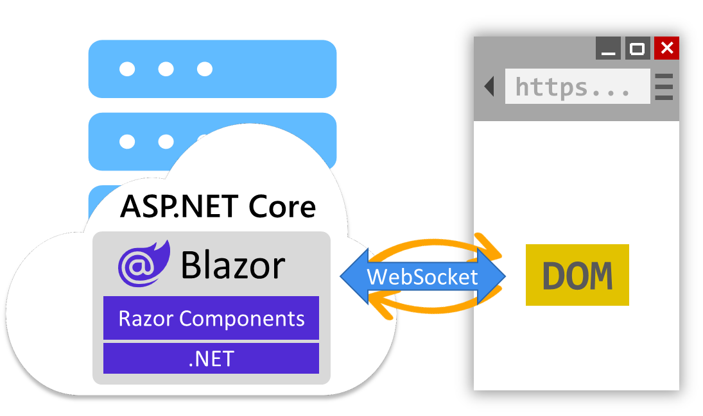
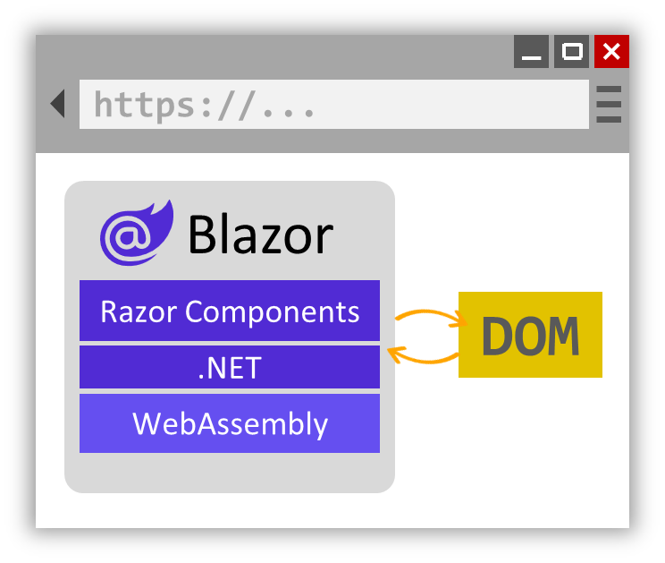

# Blazor Notes

Blazor is a framework for building interactive web UIs with C# and .NET.

## Introduction

Blazor is a complete frontend web framework based on the solid foundation of .NET that makes building web apps easier and more productive.

## What is Blazor?
Blazor is a modern frontend web framework based on HTML, CSS, and C# that helps you build web apps faster.
With Blazor, you build web apps using reusable components that can be run from both the client and the server.
Blazor is part of .NET, a developer platform for building anything. 

- Blazor components can also be used to build native mobile & desktop apps using a hybrid of native and web, called Blazor Hybrid.
- Blazor's flexible component model makes it easy to build reusable components that you can use to assemble apps quickly.
- Build your entire web app from the frontend to the backend using a single development stack and share code for common logic on the client and server.
- implement component logic all in C#, a modern type-safe language that is easy to learn and highly versatile.
- Use Visual Studio or Visual Studio Code to get started in seconds and stay productive with great code editing support.

## How Blazor works?
### Blazor Component
Blazor apps are built from components: 
- component is a reusable piece of web UI.
- encapsulates both its rendering and UI event handling logic.
- many pre-built Blazor components are available from the Blazor ecosystem.
- You author Blazor components using Razor syntax using `HTML`, `CS` and `C#`. 

Blazor includes various built-in components for form handling, user input validation, displaying large data sets, authentication, and authorization.

>Razor files are then compiled into C# classes that encapsulate the component's rendering logic.

Blazor also includes support for two-way data binding to UI elements as a way to keep component state in sync with UI elements.
- data binding can be:
  - **one-way binding:** the UI updates when data changes.
  - **two-way binding:** both the UI and the data update each other automatically.

### UI event handling and data binding

The following example is a simple Blazor counter component implemented in Razor.
```html
<h1>Counter</h1>

<p role="status">Current count: @currentCount</p>

<button class="btn btn-primary" @onclick="IncrementCount">Click me</button>

<!-- C# Code Here -->
@code { 
    private int currentCount = 0;

    private void IncrementCount() 
    {
        currentCount++;
    }
}
```
### Server and client-side rendering
Blazor supports both **server-side rendering (SSR) and client-side rendering (CSR)** of components to handle various web UI architectures.
Components rendered from the server can access server resources, like databases and backend services.
By default, Blazor components are rendered statically from the server, generating HTML in response to requests.

You can also configure server components to be interactive, so they can handle arbitrary UI events, maintain state across interactions, and render updates dynamically.
Interactive server components handle UI interactions and updates over a WebSocket connection with the browser.



Alternatively, Blazor components can be rendered interactively from the client.
The component is downloaded to the client and run from the browser via WebAssembly.
Interactive WebAssembly components can access client resources through the web platform, like local storage and hardware, and can even function offline once downloaded.



You can choose to render different components from the server or the client within the same app. Many of the pages in your app might not require any interactivity at all, and can be rendered statically from the server.
While other more interactive parts of your app can be handled from the server or client.
You can decide which component render mode to use at design time or runtime.
With Blazor, you have the flexibility to build the web app architecture that's right for your scenario.

